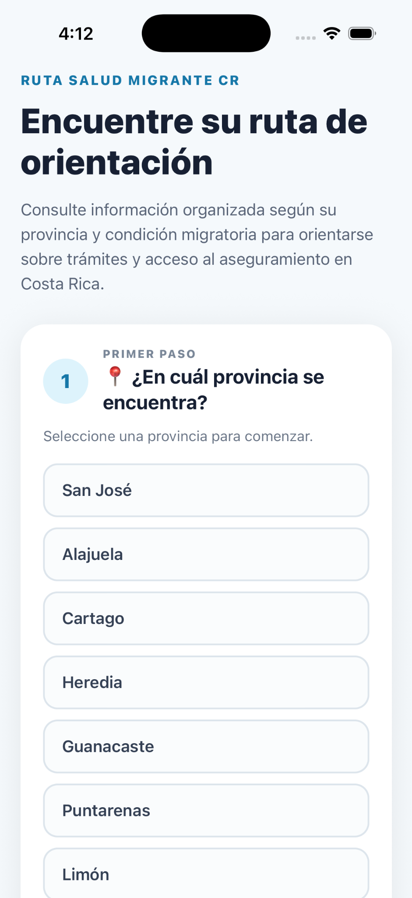
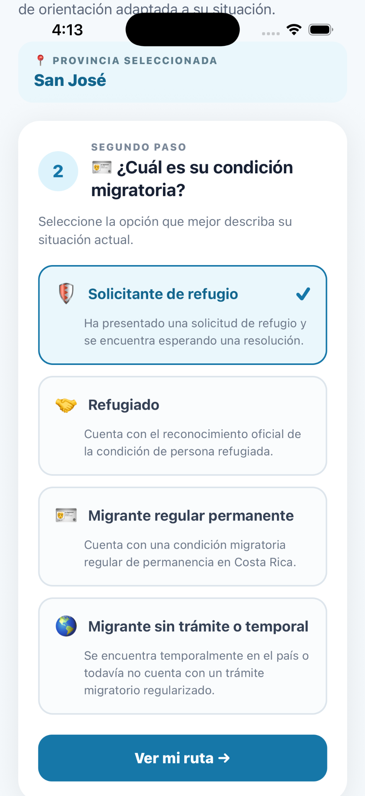
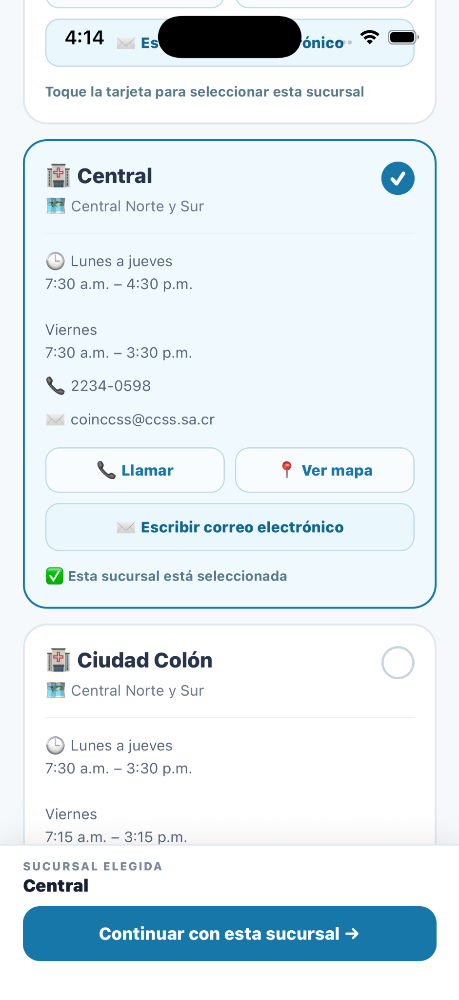
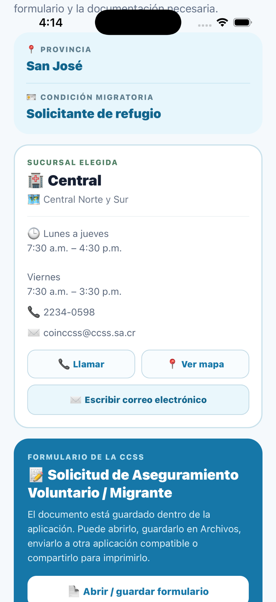
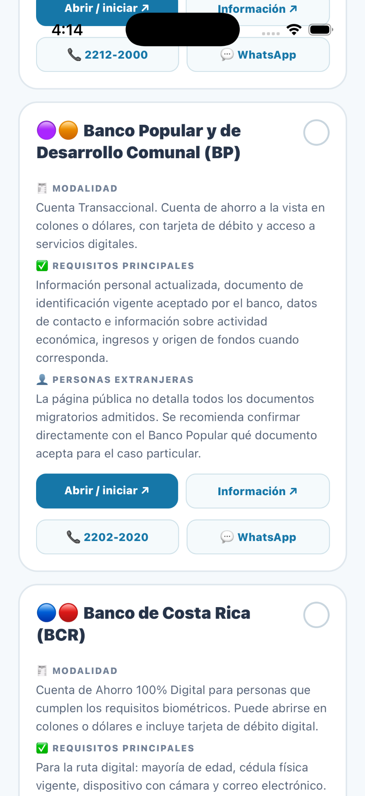
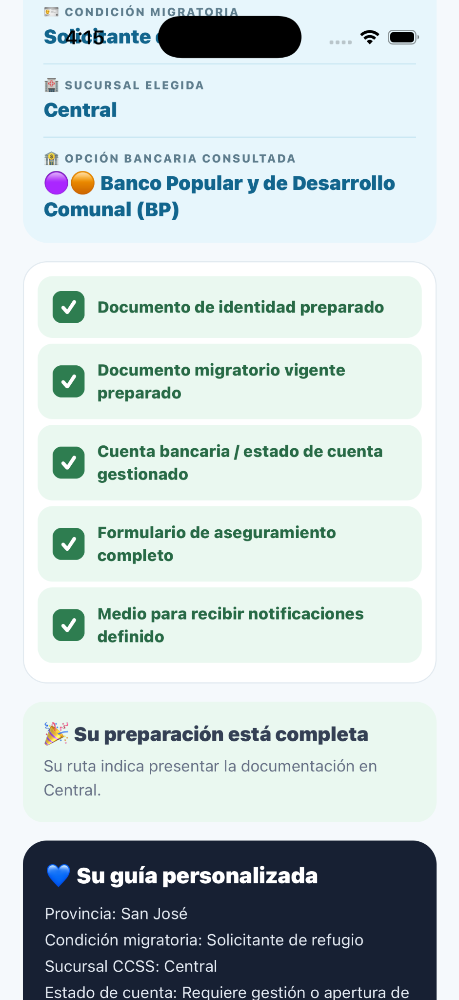

<div align="center">


# Ruta Salud Migrante CR

### Orientación digital para personas migrantes en Costa Rica

Aplicación móvil desarrollada con **React Native, Expo y TypeScript** para organizar, en una sola ruta de consulta, información sobre condición migratoria, trámites, sucursales de la CCSS, aseguramiento, opciones bancarias y organizaciones de apoyo.

**Estado del proyecto:** Beta funcional · Proyecto académico / TCU · Costa Rica 🇨🇷

</div>

---

## 📱 Sobre el proyecto

**Ruta Salud Migrante CR** busca facilitar el acceso a información dispersa que una persona migrante puede necesitar al orientarse sobre trámites y servicios en Costa Rica.

La aplicación construye una **ruta personalizada de orientación** a partir de dos decisiones iniciales:

1. La provincia en la que se encuentra la persona.
2. Su condición migratoria.

A partir de esas selecciones, la aplicación organiza el recorrido paso a paso y presenta únicamente la información relevante para el perfil consultado.

> La aplicación es una herramienta de orientación. No sustituye la información, valoración, resolución ni atención oficial de las instituciones competentes.

---


## 📸 Vista de la aplicación

La versión beta ha sido probada como aplicación nativa en **iOS Simulator**. Estas capturas muestran parte del recorrido principal de la experiencia.

<p align="center">
  
  
  
</p>

<p align="center">
  <sub><b>Inicio</b> · <b>Condición migratoria</b> · <b>Selección de sucursal CCSS</b></sub>
</p>

<p align="center">
  
  
  
</p>

<p align="center">
  <sub><b>Aseguramiento</b> · <b>Opciones bancarias</b> · <b>Checklist final</b></sub>
</p>

---

## ✨ Funcionalidades principales

### 🧭 Ruta personalizada

La aplicación organiza la consulta según:

- Provincia.
- Condición migratoria.
- Trámites aplicables.
- Subtrámites relacionados.
- Sucursal de la CCSS seleccionada.
- Preparación para aseguramiento.
- Necesidad de cuenta bancaria.
- Organizaciones de apoyo.
- Checklist final.

### 🪪 Orientación migratoria

Actualmente contempla cuatro perfiles principales:

- Solicitante de refugio.
- Persona refugiada.
- Migrante regular permanente.
- Migrante sin trámite o con condición temporal.

Cada perfil conduce a información y trámites relacionados con su situación.

### 🏥 Sucursales de la CCSS

La aplicación incorpora información de **83 sucursales** distribuidas en las siete provincias de Costa Rica.

Para cada sucursal, cuando la información está disponible, se muestran:

- Nombre.
- Región.
- Horario.
- Teléfonos.
- Correo electrónico o formulario general de contacto.
- Ubicación en mapa.
- Acciones directas para llamar, escribir o abrir la ubicación.

La persona puede seleccionar una sucursal y conservar sus datos visibles durante el paso de preparación del aseguramiento.

### 🛡️ Preparación para aseguramiento

La aplicación incorpora el formulario de **Solicitud de Aseguramiento Voluntario / Migrante** y permite:

- Abrir o guardar el formulario.
- Revisar información necesaria para completarlo.
- Consultar los datos de la sucursal elegida.
- Acceder al sitio oficial de la CCSS para verificar información.

### 🏦 Orientación bancaria

Incluye información comparativa de cuatro entidades bancarias:

- Banco Nacional de Costa Rica.
- Banco Popular y de Desarrollo Comunal.
- Banco de Costa Rica.
- BAC.

Se presentan requisitos generales, consideraciones para personas extranjeras, información oficial y canales de contacto.

### 🤝 Organizaciones de apoyo

La guía también incorpora organizaciones que pueden brindar orientación o acompañamiento adicional, incluyendo:

- Clínica de Refugio, Migración y Protección Internacional — Universidad de Costa Rica.
- Servicio Jesuita para Migrantes Costa Rica.
- Consultorio jurídico / servicios de apoyo universitario incorporados en la base del proyecto.

### ✅ Checklist final

Al finalizar el recorrido, la aplicación genera una guía personalizada con los elementos seleccionados y permite marcar documentos o pasos preparados antes de continuar con las gestiones correspondientes.

---

## 🧩 Flujo de la aplicación

```text
Provincia
   ↓
Condición migratoria
   ↓
Ruta de orientación
   ↓
Trámites y subtrámites
   ↓
Selección de sucursal CCSS
   ↓
Preparación del aseguramiento
   ↓
¿Necesita cuenta bancaria?
   ↓
Organizaciones de apoyo
   ↓
Checklist y guía personalizada
```

---

## 🛠️ Tecnologías

| Tecnología | Uso |
|---|---|
| **React Native** | Desarrollo de la interfaz móvil |
| **Expo** | Entorno, compilación y herramientas nativas |
| **Expo Router** | Navegación basada en archivos |
| **TypeScript** | Tipado y estructura del proyecto |
| **Expo Asset** | Manejo de documentos incluidos en la app |
| **Expo Sharing** | Apertura y compartición del formulario |
| **Xcode / iOS Simulator** | Pruebas nativas en iOS |
| **EAS** | Configuración para builds y distribución |
| **Airtable** | Fuente estructurada utilizada durante el desarrollo y curación de datos |

---

## 📂 Estructura principal

```text
ruta-salud-migrante-cr/
├── app/
│   └── (tabs)/
│       ├── index.tsx
│       ├── condicion.tsx
│       ├── ruta.tsx
│       ├── tramite.tsx
│       ├── subtramite.tsx
│       ├── sucursal.tsx
│       ├── aseguramiento.tsx
│       ├── bancos.tsx
│       ├── organizaciones.tsx
│       └── checklist.tsx
├── assets/
│   ├── documents/
│   └── images/
├── data/
│   ├── bancos.ts
│   ├── organizaciones.ts
│   ├── rutas.ts
│   ├── subtramites.ts
│   ├── sucursales.ts
│   └── tramites.ts
├── app.json
├── eas.json
├── metro.config.js
└── package.json
```

---

## 🚀 Ejecutar localmente

### Requisitos

- Node.js.
- npm.
- Expo.
- Para iOS nativo: macOS + Xcode.
- Para Android nativo: Android Studio o un dispositivo compatible.

### Instalar dependencias

```bash
npm install
```

### Ejecutar con Expo

```bash
npx expo start
```

### Compilar y abrir en iOS Simulator

```bash
npx expo run:ios
```

### Verificar la configuración pública de Expo

```bash
npx expo config --type public
```

---

## 🧪 Estado actual

La versión beta ya ha sido probada como aplicación nativa en **iOS Simulator**, incluyendo:

- Ícono nativo.
- Splash screen.
- Navegación completa.
- Selección de provincia y condición migratoria.
- Trámites y subtrámites.
- Selección de sucursal.
- Datos de contacto y mapas.
- Formulario de aseguramiento.
- Información bancaria.
- Organizaciones de apoyo.
- Checklist final.

El proyecto continúa en una fase de **QA, revisión de contenido y preparación para distribución de prueba**.

---

## 📚 Datos y fuentes

La información incorporada en la aplicación se ha estructurado a partir de fuentes públicas y oficiales consultadas durante el desarrollo del proyecto, entre ellas:

- Caja Costarricense de Seguro Social (CCSS).
- Dirección General de Migración y Extranjería (DGME).
- Entidades bancarias incluidas en la aplicación.
- Organizaciones de apoyo incorporadas en la guía.
- Información documental recopilada y organizada para el proyecto.

La disponibilidad, requisitos, horarios, procedimientos y canales institucionales pueden cambiar. Antes de realizar un trámite, la persona usuaria debe **verificar la información directamente con la institución competente**.

---

## ⚠️ Aviso importante

Ruta Salud Migrante CR:

- No representa oficialmente a la CCSS, DGME, bancos, universidades u organizaciones incluidas.
- No constituye asesoría legal, migratoria, financiera ni médica.
- No garantiza elegibilidad para trámites, servicios, productos bancarios o aseguramiento.
- No sustituye los canales oficiales.
- Está diseñada como una herramienta educativa y de orientación.

---

## 🎯 Propósito

El proyecto busca explorar cómo el **diseño de información, la tecnología y la estructuración de datos** pueden reducir barreras de acceso a información pública y facilitar recorridos institucionales complejos.

Se desarrolla en el contexto de un **Trabajo Comunal Universitario (TCU)** y como proyecto de aplicación de herramientas digitales a problemas de acceso, orientación y servicios públicos.

---

## 👨‍💻 Autor

**Juan Ignacio Garbanzo Fallas**

Ciencia Política · Economía · Ciencia de Datos  
Costa Rica 🇨🇷

GitHub: [@juaniflls](https://github.com/juaniflls)

---

## 📌 Estado del repositorio

> **Beta — en desarrollo activo**

La estructura, contenidos, interfaces y fuentes pueden continuar cambiando durante las etapas de revisión y validación.

---

<div align="center">

### Ruta Salud Migrante CR

**Tecnología aplicada a la orientación, el acceso a información y la inclusión.**

</div>
