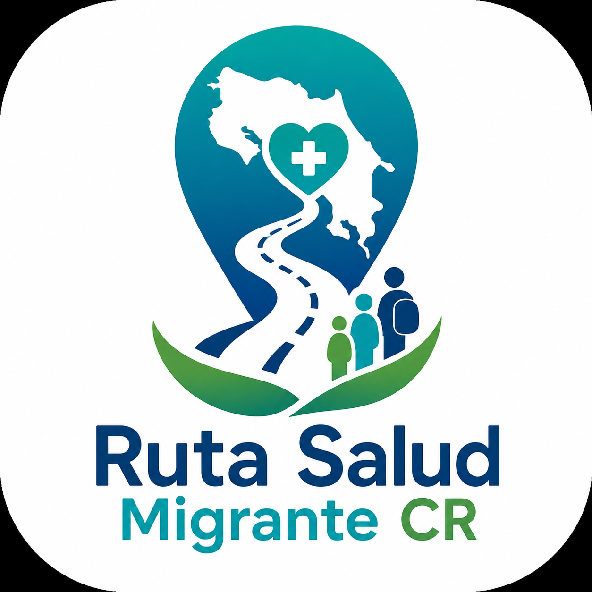

from pathlib import Path

readme = r'''<div align="center">



# Ruta Salud Migrante CR

### Orientación digital para personas migrantes en Costa Rica

Aplicación móvil desarrollada con **React Native, Expo y TypeScript** para organizar, en una sola ruta de consulta, información sobre condición migratoria, trámites, sucursales de la CCSS, aseguramiento, opciones bancarias y organizaciones de apoyo.

**Estado del proyecto:** Beta funcional · Proyecto académico / TCU · Costa Rica 🇨🇷

</div>

---

## 📱 Sobre el proyecto

**Ruta Salud Migrante CR** busca facilitar el acceso a información dispersa que una persona migrante puede necesitar al orientarse sobre trámites y servicios en Costa Rica.

La aplicación construye una **ruta personalizada de orientación** a partir de dos decisiones iniciales:

1. La provincia en la que se encuentra la persona.
2. Su condición migratoria.

A partir de esas selecciones, la aplicación organiza el recorrido paso a paso y presenta únicamente la información relevante para el perfil consultado.

> La aplicación es una herramienta de orientación. No sustituye la información, valoración, resolución ni atención oficial de las instituciones competentes.

---

## ✨ Funcionalidades principales

### 🧭 Ruta personalizada

La aplicación organiza la consulta según:

- Provincia.
- Condición migratoria.
- Trámites aplicables.
- Subtrámites relacionados.
- Sucursal de la CCSS seleccionada.
- Preparación para aseguramiento.
- Necesidad de cuenta bancaria.
- Organizaciones de apoyo.
- Checklist final.

### 🪪 Orientación migratoria

Actualmente contempla cuatro perfiles principales:

- Solicitante de refugio.
- Persona refugiada.
- Migrante regular permanente.
- Migrante sin trámite o con condición temporal.

Cada perfil conduce a información y trámites relacionados con su situación.

### 🏥 Sucursales de la CCSS

La aplicación incorpora información de **83 sucursales** distribuidas en las siete provincias de Costa Rica.

Para cada sucursal, cuando la información está disponible, se muestran:

- Nombre.
- Región.
- Horario.
- Teléfonos.
- Correo electrónico o formulario general de contacto.
- Ubicación en mapa.
- Acciones directas para llamar, escribir o abrir la ubicación.

La persona puede seleccionar una sucursal y conservar sus datos visibles durante el paso de preparación del aseguramiento.

### 🛡️ Preparación para aseguramiento

La aplicación incorpora el formulario de **Solicitud de Aseguramiento Voluntario / Migrante** y permite:

- Abrir o guardar el formulario.
- Revisar información necesaria para completarlo.
- Consultar los datos de la sucursal elegida.
- Acceder al sitio oficial de la CCSS para verificar información.

### 🏦 Orientación bancaria

Incluye información comparativa de cuatro entidades bancarias:

- Banco Nacional de Costa Rica.
- Banco Popular y de Desarrollo Comunal.
- Banco de Costa Rica.
- BAC.

Se presentan requisitos generales, consideraciones para personas extranjeras, información oficial y canales de contacto.

### 🤝 Organizaciones de apoyo

La guía también incorpora organizaciones que pueden brindar orientación o acompañamiento adicional, incluyendo:

- Clínica de Refugio, Migración y Protección Internacional — Universidad de Costa Rica.
- Servicio Jesuita para Migrantes Costa Rica.
- Consultorio jurídico / servicios de apoyo universitario incorporados en la base del proyecto.

### ✅ Checklist final

Al finalizar el recorrido, la aplicación genera una guía personalizada con los elementos seleccionados y permite marcar documentos o pasos preparados antes de continuar con las gestiones correspondientes.

---

## 🧩 Flujo de la aplicación

```text
Provincia
   ↓
Condición migratoria
   ↓
Ruta de orientación
   ↓
Trámites y subtrámites
   ↓
Selección de sucursal CCSS
   ↓
Preparación del aseguramiento
   ↓
¿Necesita cuenta bancaria?
   ↓
Organizaciones de apoyo
   ↓
Checklist y guía personalizada
